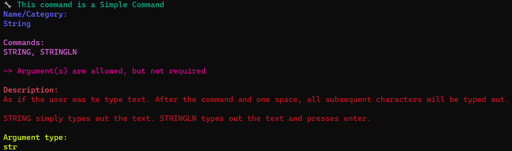
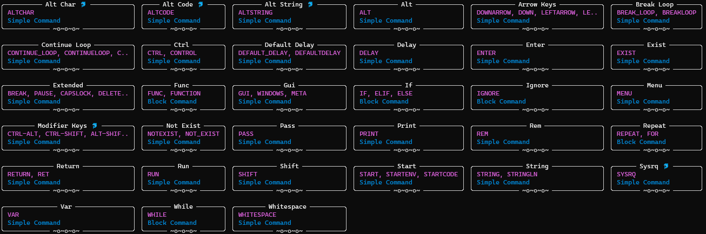

# Command Line Interface (CLI)
The command line interface is used to compile your code, and help assist you on your programming endeavors.

When you need help on using the CLI, you can use `--help`:
```
duckling --help
```
You can also use `--help` on specific commands:
```
duckling compile --help
```

## CLI Commands
`new` - Creates a new project. This project will include a config file, and a main file.

Usage:
```
duckling new [OPTIONS] NAME [PATH]
```
Example:
```
duckling new example-proj
```
Output Tree
```
example-proj
|- config.yaml
|- main.txt
```

`compile` - Compiles your DucklingScript code into Rubber Ducky Language 1.0. Give the file to compile, and then give the output location.

Usage:
```
duckling compile [OPTIONS] FILENAME [OUTPUT]
```
Options given to you through the command can also be adjusted through global config files.

`help` - Gives you details on any command you give it.

Usage:
```
duckling help [OPTIONS] COMMAND_NAME
```
Output if we give it `string`:
```
duckling help string
```


`all` - Shows all the commands in the programming language. In the future, this may include all plug-in commands as well.

All commands as of November 28th, 2023:


`version` - Gives the current version of DucklingScript.

Usage:
```
duckling version
```
Output as of November 28th, 2023:
```
Ducklingscript is version 0.1.0
```

## Global Config File
Upon using the CLI in anyway, a global config is made/edited. The keys inside of the global config should be identical to the keys that you find inside of the project scoped config file. By editing the global config, you can change configurations for any time you compile a project-less script.