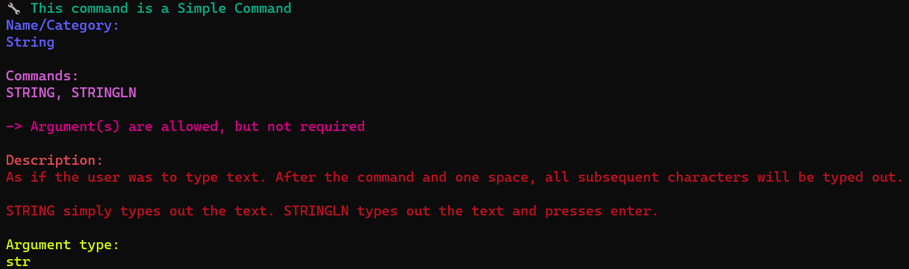
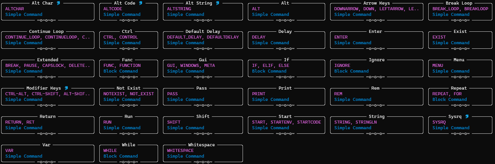

# Command Line Interface (CLI)
Let's talk about the CLI (Command Line Interface, aka terminal) support our ducks provide.

To start, you can learn about many, if not all, of the things our aquatic aviaries can offer here by using the `--help` flag:
```
duckling --help
```

This behavior also ties into prefixing commands as an argument before the flag, in this case, `compile`:
```
duckling compile --help
```

## CLI Commands
Here we'll cover a few of the available commands our ducks can recognize in the CLI.


### new
The `new` command can be used to have our ducks build you a new project, taking in any options, the name of the project, and optionally a directory path to put it in like so: `duckling new [OPTIONS] NAME [PATH]`. This will create a file tree with a folder named after the project that contains the default `config.yaml` and `main.txt` files you can use to get started.

Example:
```
duckling new example-proj
```

Output Tree
```
example-proj
|- config.yaml
|- main.txt
```

### compile
Using the `compile` command tells our ducks you're ready for them to read over what you've made, converting it over to Rubber Ducky 1.0 in a process called "compilation". You can tell our ducks exactly how you want this to be done by passing in the options, the file to compile, and the output directory of where you want the results to go like so: `duckling compile [OPTIONS] FILENAME [OUTPUT]`. Along with this, you can also adjust any of the options you could normally give the command via the global config.

### help
Similar to the `--help` flag, `help` can be used to tell our ducks you'd like more about the given command like so: `duckling help [OPTIONS] COMMAND_NAME`.


Here's what our ducks have to say about the `string` command:
```
duckling help string
```



### all
Using the `all` command will have our ducks give you an overview of every command available in DucklingScript, and possibly any added commands added by plug-ins as well.

All commands as of November 28th, 2023:


### version
As you might expect, the `version` command will just ask our ducks what version of DucklingScript you're currently using like this: `duckling version`.

Output as of November 28th, 2023:
```
Ducklingscript is version 0.1.0
```

## Global Config File
When using the CLI, our ducks will automatically create or modify a global config file. The keys inside of this global config should be identical to the ones you can find inside of the projects `config.yaml` file. This global config lets you define the desired behavior any time you compile a script file that doesn't already belong to a project (if it does belong to a project the project `config.yaml` will be used instead).