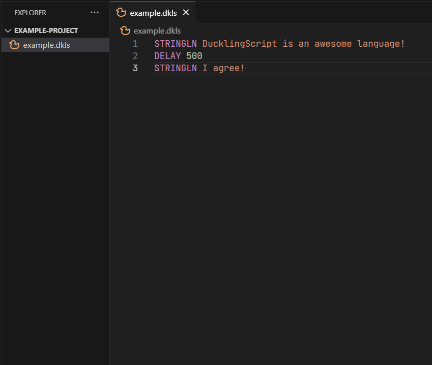

IDE Support is syntax highlighting and other tools to help a programmer write code in a language.

Currently, DucklingScript only supports one IDE, which is...

## Visual Studio Code

DucklingScript supports Visual Studio Code with the DucklingScript extension that can be found on the Visual Studio Code
Marketplace simply just by looking up "DucklingScript;" or alternatively here is the link: [DucklingScript](https://marketplace.visualstudio.com/items?itemName=DragonofShuu.ducklingscript-language-support).

To use the extension, simply make a file extension ending in `.dkls`, and DucklingScript will automatically begin syntax highlighting.

